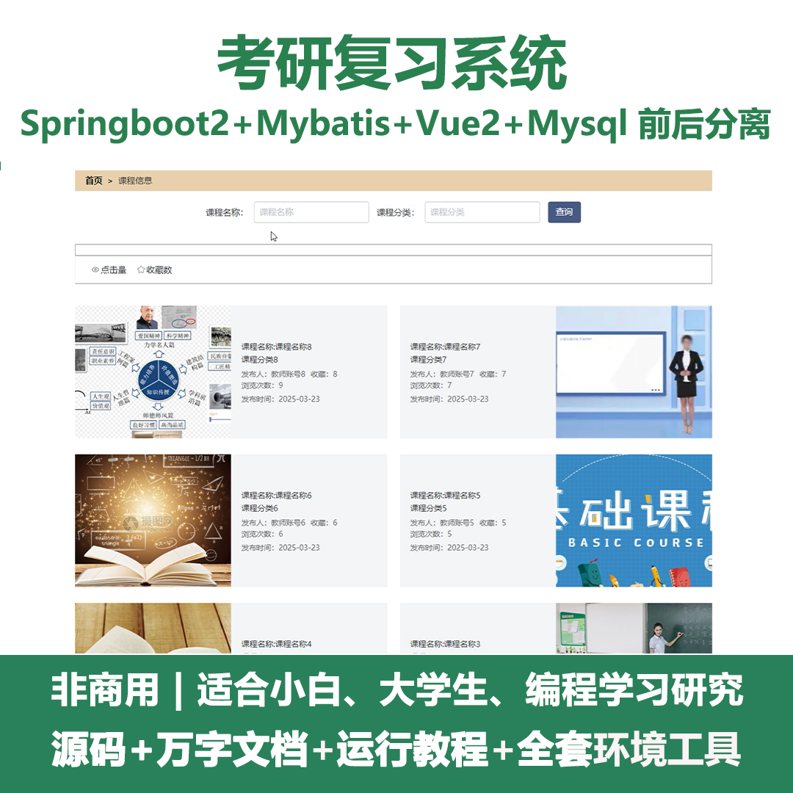
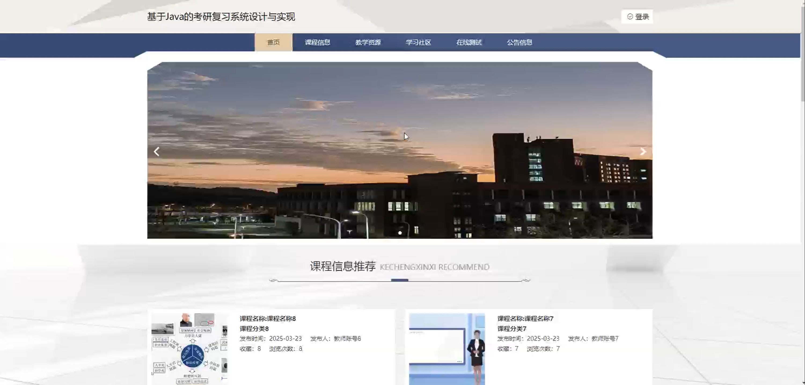
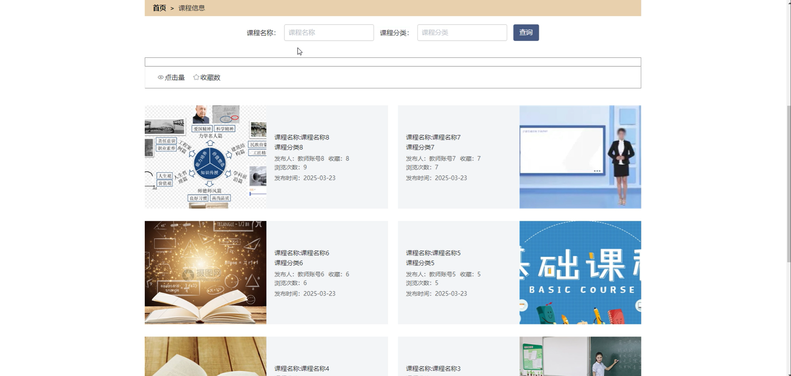
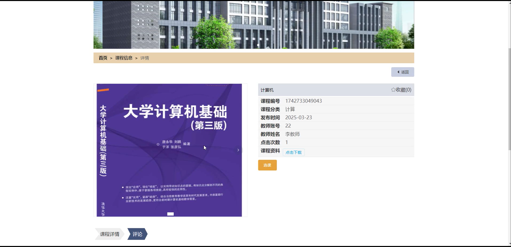
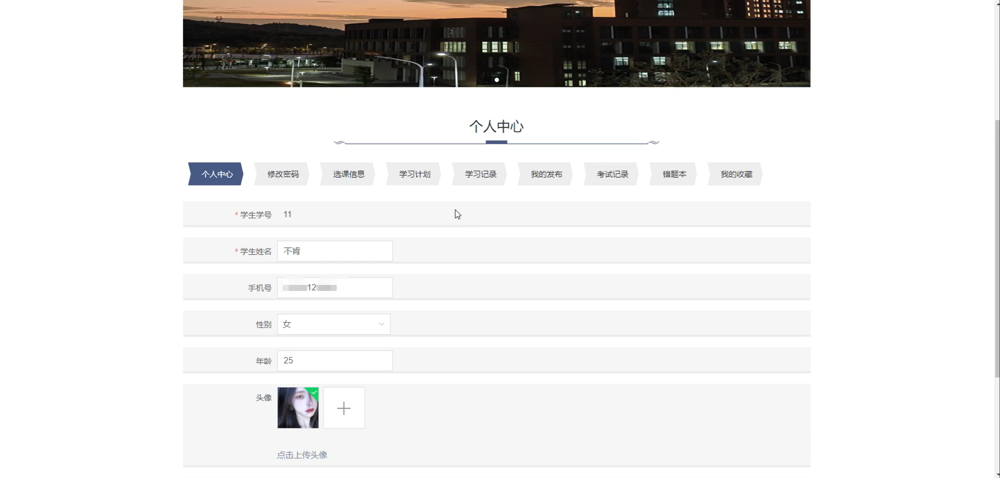
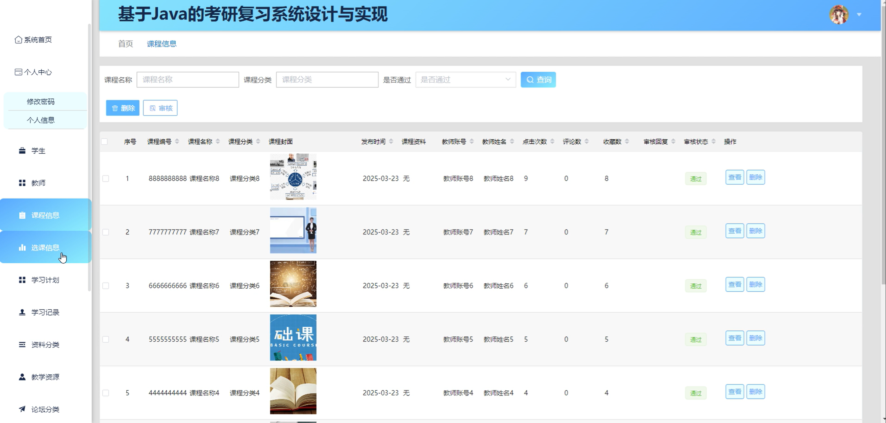
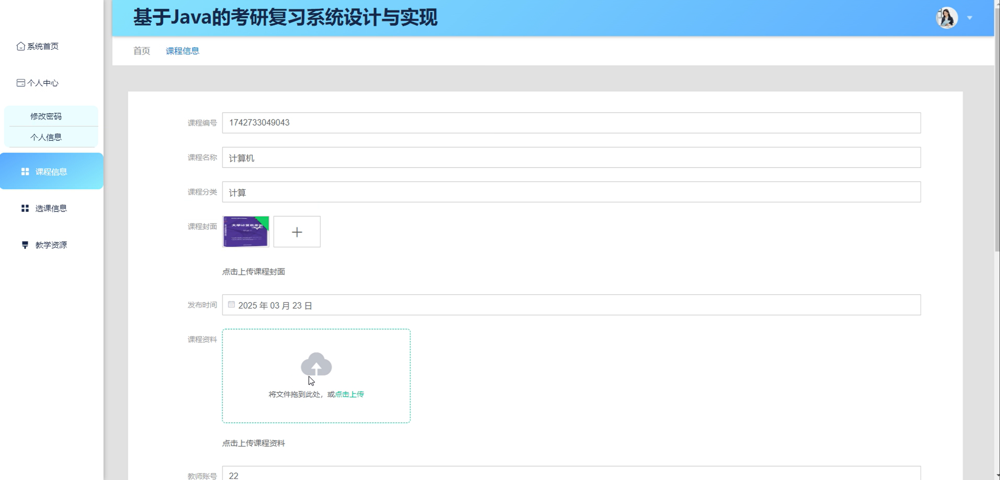
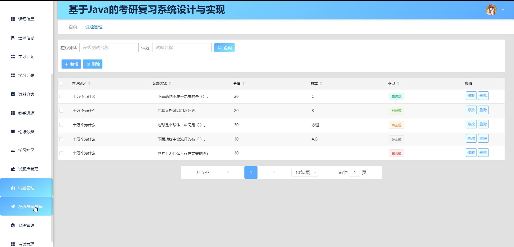
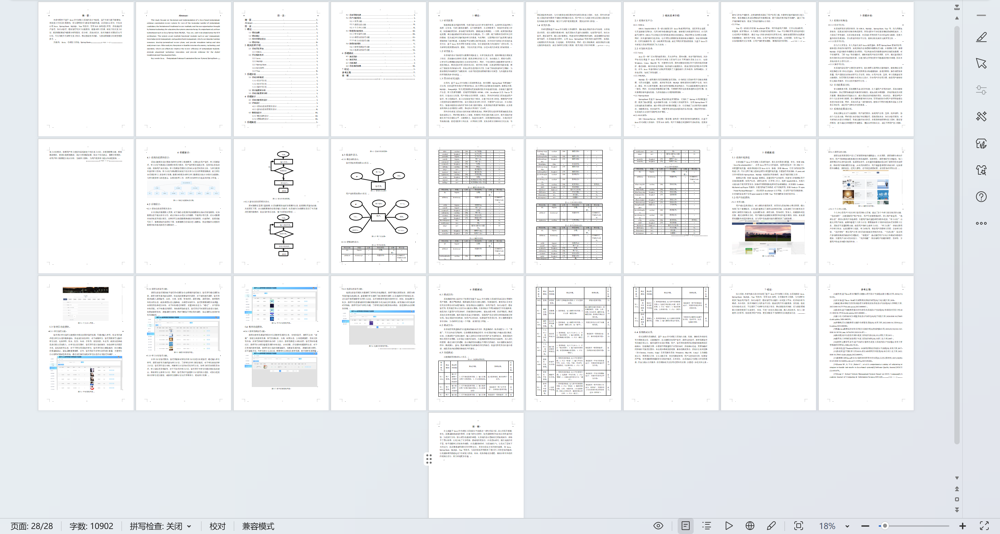

# springbootA428D
springbootA428D考研复习系统+LW
 
## 查看主页获取源码

### 一、关键词
课程信息、选课信息、学习计划

### 二、作品包含
源码+数据库+设计文档万字+全套环境和工具资源+本地部署教程

### 三、项目技术
前端技术：Html、Css、Js、Vue2.0、Element-ui 
后端技术：Java、SpringBoot2.0、MyBatis

### 四、运行环境（以下版本亲测，其他版本未知，请自测）
开发工具：IDEA/eclipse  + VSCODE

数据库：MySQL5.7（最低要5.7版本）

数据库管理工具：Navicat10以上版本

环境配置软件： JDK1.8 + Maven3.6.3

前端Nodejs：14

浏览器：谷歌浏览器

### 五、项目介绍
项目编号：springbootA428D

考研复习系统可帮助考生系统规划复习进度、整合学习资源、检测知识掌握程度，从而高效备战考研。

角色：管理员、用户、教师

管理员：系统首页、个人中心、学生、教师、课程信息、选课信息、学习计划、学习记录、资料分类、教学资源、论坛分类、学习社区。

用户：首页、课程信息、教学资源、学习社区、在线测试、公告信息、个人中心、修改密码、选课信息、学习计划、学习记录、我的发布、考试记录、错题本、我的收藏。

教师：系统首页、个人中心、课程信息、选课信息、教学资源。

### 六、运行截图

